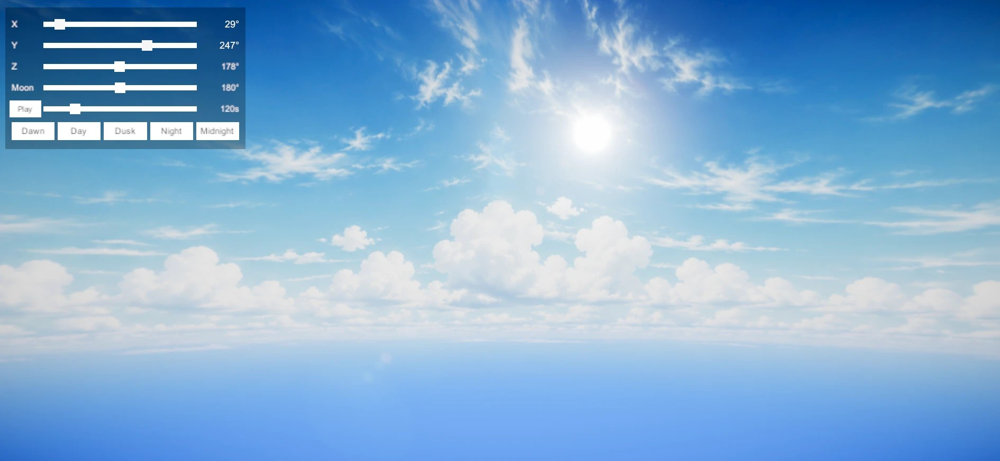

# Day Night Skybox (URP)



A stylized skybox with a full day/night cycle for the Universal Render Pipeline.

- Sun driven by your Directional Light: grows and turns orange at sunset, sinks behind the ocean
- Moon on the sun's daily path, with halo and night-sky glow; it never breaks when overhead
- Day / sunset / night cloud panoramas that blend smoothly and slowly rotate
- Sunset glow spreading along the horizon
- Tiling star field that fades toward the horizon and twinkles in patches
- Clouds hide the sun and moon
- Runtime panel: sun rotation sliders, moon slider, Dawn / Day / Dusk / Night / Midnight buttons, automatic time flow
- Sun light, ambient light and SRP Lens Flare fade out at night

## Requirements

- Unity 6 (6000.0) or newer
- Universal Render Pipeline 17+
- Unity UI (uGUI)
- Input System (optional; used for the UI event system when installed)

## Install

**Option A — Package Manager (Git URL)**

1. Open **Window > Package Manager**.
2. Click **+ > Install package from git URL...**
3. Enter:
   ```
   https://github.com/Parrot222/DayNightSkybox.git
   ```

**Option B — .unitypackage**

Download `DayNightSkybox-1.0.0.unitypackage` from the Releases page and double-click it (or **Assets > Import Package > Custom Package...**).

## Setup

1. **Skybox:** open **Window > Rendering > Lighting > Environment** and set **Skybox Material** to `Materials/DayNightSkybox.mat`.
2. **Sun:** make sure the scene has a Directional Light and that it is set as **Sun Source** in the same window.
3. **Moon:** add the `MoonController` component to any GameObject (for example the Directional Light).
4. **UI (optional):** add the `SunAngleUI` component to any GameObject. The panel is created when you press Play.

## Components

### SunAngleUI
| Field | Description |
|---|---|
| Presets | Name and sun X angle of each time-of-day button |
| Transition Duration | Seconds to blend to a preset (0 = instant) |
| Time Flow On Start / Day Length Seconds | Automatic time flow; one sun revolution takes this many seconds |
| Fade Light At Night | Fades the sun and ambient light using Night Start / Night End |
| Flare Fade Start / End | Sun height range where the SRP Lens Flare fades out |

### MoonController
| Field | Description |
|---|---|
| Moon Phase | How far the moon trails the sun, in revolutions (0.5 = opposite the sun) |
| Auto Advance Phase | Moves the moon a little each day while time flows (Play mode) |

Sun height in these fields is the sine of the sun's elevation: 0 = horizon, 1 = straight up.

## Material Settings (highlights)

| Group | Property | Notes |
|---|---|---|
| Cloud Panoramas | Day / Night / Sunset Clouds | Equirectangular panoramas; Tiling/Offset in `Panorama Tiling` |
| Sky Gradient | Top Blend (XY) / Bottom Blend (ZW) | Panorama height where the top and bottom colors take over (0.5 = horizon) |
| Day Night Timing | Night Start / Night End | Sun height range of the day/night blend |
| Day Night Timing | Sunset Range Day / Night | Smaller range = sunset closer to the horizon |
| Sun | Sunset Sun Size, Horizon Cutoff | Sun grows at sunset; cutoff hides it below the horizon |
| Cloud Occlusion | Cloud Mask (G), See Through Clouds | Where clouds hide the sun and moon |
| Horizon Glow | Thinness / Focus Toward Sun | Shape of the sunset glow band |
| Moon | Moon Size, Edge, Daytime Visibility, Halo | Moon look |
| Stars | Fade By Height, Twinkle Noise / Speed / Amount | Star field and twinkling |

Tip: enable **Stop NaNs** on the camera and use Bloom; the sun and moon colors are HDR.

## License

MIT — see [LICENSE.md](LICENSE.md).
